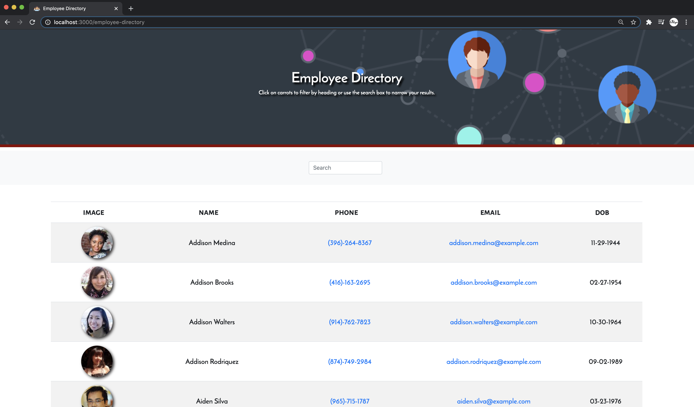

# Unit 19 React Employee Directory
<hr> 
<br> 


  
## Description
This Employee Directory App was created with React. It allows the user to sort the table by name, phone number, email and dob (date of birth). It also allows user to search for a specific employee.


## Table of Contents
* [Description](#description)
* [Installation](#installation)
* [Usage](#usage)
* [Preview](#preview)
* [Website](#website)
* [License](#license)
* [Contributing](#contributing)
* [Test](#tests)
* [Questions](#questions)
  
## Installation

```
No installation is needed to use this app. 
  ```
`Simply click on ` [here](https://sirog-e.github.io/employee-directory/)  ` to start using the app.`

For Developers: After cloning this repo, make sure you run `npm i` to install all dependencies and then `npm start` to view the app on your local port. 
 

## Usage
When using this app the user will be able to view an entire employee directory at once so that the user can have quick access to their information.


## Preview



### Website

[Employee Directory - GitHub Pages](https://sirog-e.github.io/employee-directory/) 


## Contributing
\
[SIROG-E](https://github.com/SIROG-E)

## Test
 


